# 🎨 Photo Abstract Editorial

A source-faithful Agent Skill that turns photographs into editorial artworks with adaptive layouts, controlled abstraction, and a deterministic composition path.

[English](README.md) · [简体中文](README.zh-CN.md) · [繁體中文](README.zh-TW.md)

   

Photo Abstract Editorial keeps the source photograph factual, turns source-derived relationships into a restrained abstraction panel, and renders the editorial title locally where the verified path supports it.

## Before → After

**Same source · Actual V3 output · Strict Fidelity / validator PASS**

The source is shown unchanged. The result is the existing V3 same-source artifact in this repository; its [manifest](assets/readme/comparisons/original-horizon/v3-result.png.manifest.json) records a pixel-exact photographic region, and the published same-source check reports validator PASS.

| Before | After |
|---|---|
| 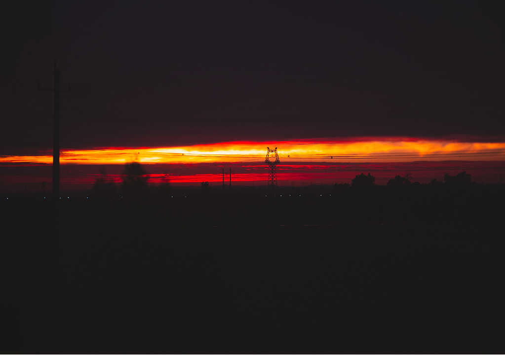 | 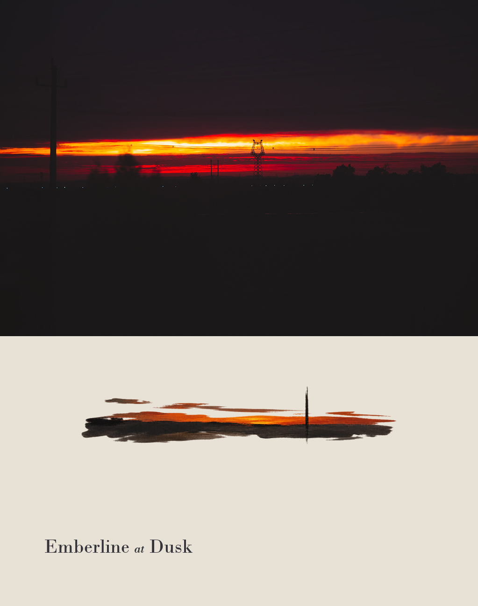 |

**Jump to:** [Quick Start](#quick-start) · [Gallery](#gallery) · [Choose an Edition](#choose-an-edition) · [Compatibility](#compatibility) · [Validation](#validation) · [Releases](#releases)

## ⚡ 30-Second Quick Start

V3 Adaptive is the recommended starting point for most new users.

### Install

Download the [v3.0.0 release ZIP](https://github.com/kwhi6693-web/photo-abstract-editorial/releases/download/v3.0.0/photo-abstract-editorial-skill.zip) and install the included Skill, or use the existing installer method:

~~~text
Use $skill-installer to install the root photo-abstract-editorial Skill from https://github.com/kwhi6693-web/photo-abstract-editorial.
~~~

### Run

~~~text
Use $photo-abstract-editorial to create an adaptive, source-faithful photo-and-abstract editorial from this image.
~~~

### Optional Controls

~~~text
Use $photo-abstract-editorial. Set Abstraction to 60, Creative Freedom to 45, Identity Preservation to 80, and Spatial Fidelity to 70.
~~~

## 🖼️ Gallery

These five images are actual V3 outputs from the RC evaluation corpus. They are Codex Strict Fidelity results with validator PASS, not promotional reconstructions.

| Pure Portrait | Landscape | Architecture |
|---|---|---|
| 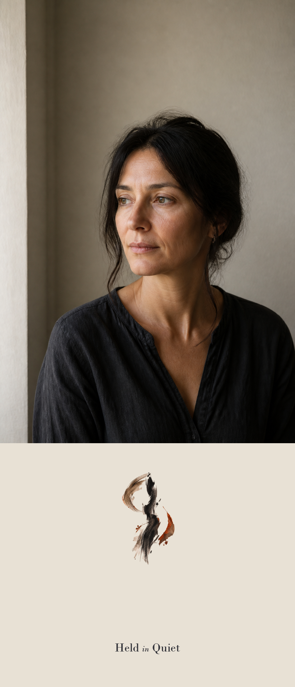 |  | 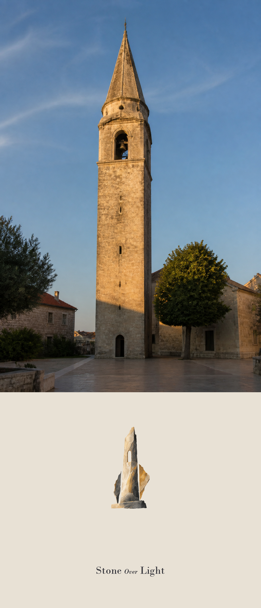 |

| Still Life | Minimal / Light |
|---|---|
| 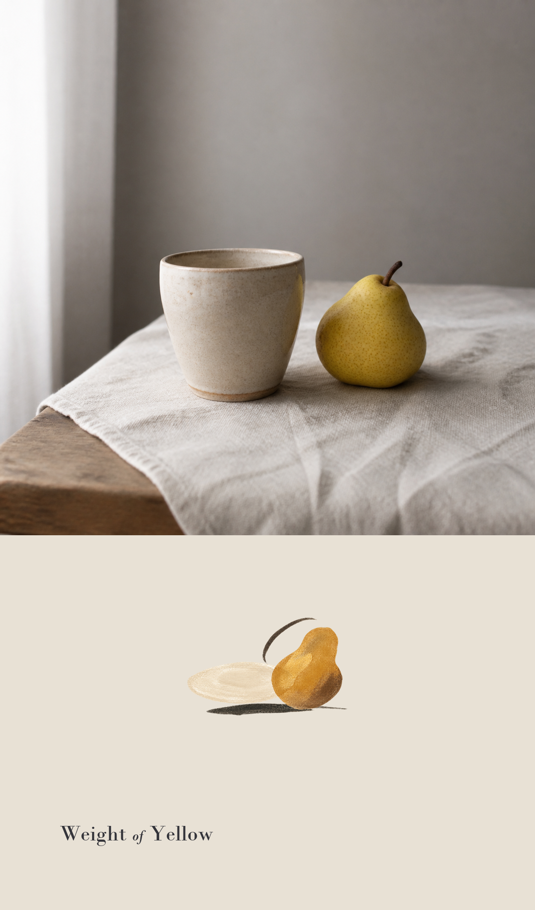 | 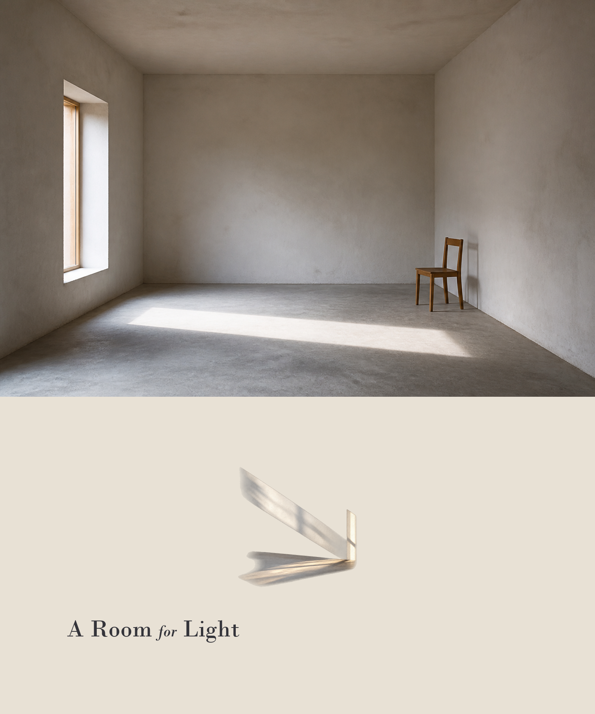 |

| Scene | Layout | Validation |
|---|---|---|
| Pure Portrait | Vertical Monument | Strict Fidelity · validator PASS |
| Landscape | Wide Horizon | Strict Fidelity · validator PASS |
| Architecture | Centered Archive | Strict Fidelity · validator PASS |
| Still Life | Sparse Object | Strict Fidelity · validator PASS |
| Minimal / Light | Sparse Object | Strict Fidelity · validator PASS |

The full corpus and manifests are in [assets/evals/v3.0-rc1](assets/evals/v3.0-rc1) and [the RC evaluation report](docs/evals/v3.0-rc1-real-world-evaluation.md).

If this workflow is useful to you, a ⭐ helps more people discover the project.

## Why Photo Abstract Editorial?

- Preserves the source photograph in the verified Strict Fidelity path.
- Chooses a scene-aware layout instead of forcing every source into one frame.
- Keeps abstraction controlled and traceable to the photograph.
- Renders exact local typography under Strict Fidelity.
- Uses structured QA before delivery.
- Provides a reproducible deterministic path where the required capabilities are available.

Generic image prompts may redraw the source photograph, lose subject identity, invent unsupported facts, produce inconsistent abstraction levels, or render unreliable typography. This project separates the factual photograph from the generated abstract motif, makes layout and creative decisions explicit, and adds a quality gate before delivery.

## 🧭 Choose Your Edition

**Recommended for most new users: V3 Adaptive.**

| | Original | V3 Adaptive |
|---|---|---|
| Runtime | Codex only | Capability-based; validated on Codex and the tested DeepSeek Harness path |
| Layout | Fixed | Adaptive |
| Controls | Manual | Four creative controls |
| QA | Original validator | Structured V3 QA |
| Best for | Historical Codex workflow | Current recommended workflow |

Original remains supported for users who want the preserved fixed Codex workflow. V3 is the current formal stable release for scene adaptation, explicit controls, adaptive layouts, structured QA, and series work. The two editions can remain available side by side.

- [Original v1.0.0 release](https://github.com/kwhi6693-web/photo-abstract-editorial/releases/tag/v1.0.0)
- [V3 Adaptive v3.0.0 release](https://github.com/kwhi6693-web/photo-abstract-editorial/releases/tag/v3.0.0)

## 🔍 Original vs V3 Comparison

Open the complete edition comparison

| Dimension | Original Edition | V3 Adaptive Edition |
|---|---|---|
| Positioning | Preserved pre-V3 workflow | Adaptive photo-plus-abstraction Skill |
| Runtime environment | Codex only | Codex and the tested DeepSeek Harness capability path validated; capability-based compatibility designed |
| Complexity | Smaller, fixed workflow | More inputs, profiles, and verification boundaries |
| Art direction | Warm-ivory panel, muted source-derived motif, optical editorial spacing | Same editorial foundation plus scene-aware art direction and control resolution |
| Source fidelity | Pixel-exact photo region validated in the Original example | Strict Fidelity pixel-exact photo region validated in Codex and the tested DeepSeek Harness path |
| Creative controls | Manual title, panel, motif, alignment, and font overrides | Abstraction, Creative Freedom, Identity Preservation, Spatial Fidelity, each 0–100 |
| Scene Profiles | None | 7: Pure Portrait, Environmental Portrait, Landscape, Architecture, Street/Crowd, Still Life, Minimal/Light |
| Portrait adaptation | Source-derived unequal vertical anchors when appropriate | Portrait-aware scene profile and identity-preservation resolution |
| Layout system | Lower Editorial predecessor: lower-left or bottom-center | 5 canonical profiles: Lower Editorial, Wide Horizon, Vertical Monument, Centered Archive, Sparse Object |
| QA | Machine validator plus visual QA; Original example has 9 validator checks | Structured 8-dimension QA, machine validator, and explicit HARD FAIL rules |
| Retry | One targeted motif correction; stop after two motif attempts | One targeted correction after a complete attempt; stop on a remaining critical HARD FAIL |
| Series | No Series Style Lock contract | Optional Series Style Lock process |
| Agent compatibility | Codex only | Codex and the tested DeepSeek Harness capability path are validated; other hosts remain capability-dependent |
| Installation | Historical Original package | V3 Adaptive package and current stable release |
| Best use cases | Stable, familiar, Codex-specific original behavior | Different scenes, explicit controls, layout adaptation, and series work |
| Main trade-off | Less adaptive and not portable beyond Codex | More process and capability requirements; native tools still vary by host |

## 🎯 Scope, Limitations & Guarantees

Open scope and guarantee details

### Original Edition

Best suited for one photograph, one text-free motif, and one fixed editorial composition in Codex. It provides deterministic local assembly and the Original validator's source/panel checks. It does not provide the V3 control system, scene profiles, canonical auto-layout, Series Style Lock, or cross-Agent contract. It is not supported outside Codex.

### V3 Adaptive Edition

Best suited for photographs that benefit from explicit scene reasoning, identity and spatial controls, adaptive layouts, or a series-level visual family. V3 does not invent unsupported people, buildings, objects, geography, text, logos, watermarks, swatches, or decorative facts. Image generation can vary across hosts and runs; current public evidence includes Codex Strict Fidelity and the independently tested DeepSeek Harness capability path.

### Guarantee Matrix

| Capability | Original | V3 Strict Fidelity | V3 Native Image Edit | V3 Reference Generation |
|---|---|---|---|---|
| Source-aware behavior | Implemented and Codex-validated | Implemented and validated on Codex and the tested DeepSeek Harness path | Best effort | Best effort |
| Scene adaptation | Fixed original behavior | Implemented and Codex-evaluated | Art-direction contract only | Art-direction contract only |
| Creative controls | Manual overrides | 4 controls, 0–100 | Host-dependent best effort | Host-dependent best effort |
| Pixel-exact photo region | Validated for Original example | Machine-validated when Strict conditions hold | Not guaranteed | Not guaranteed |
| Exact local typography | Original compositor path | Local typography path | Not guaranteed | Not guaranteed |
| Deterministic composition | Original local compositor | V3 local compositor | Not guaranteed | Not guaranteed |
| Machine validation | Original validator | V3 validator and manifest | Not a Strict output | Not a Strict output |
| Host compatibility | Codex only | Codex and the tested DeepSeek Harness path validated; suitable capability-based hosts designed for | Capability-dependent | Capability-dependent |

Native Image Edit and Reference Generation must never be described as machine-verified Strict output.

## ✨ Key Features

Open the feature-level contract

### Original Edition

- One source photograph and one sparse text-free motif.
- Source-derived bands, gaps, offsets, and unequal vertical anchors when supported by the source.
- Warm-ivory panel, muted palette, exact English title, and optical spacing.
- Deterministic local composition and JSON manifest.
- Original source/output collision guards and pixel-level photo-region validation.
- Machine validation plus visual QA.

### V3 Adaptive Edition

- Capability-based routing across Strict Fidelity, Native Image Edit, and Reference Generation.
- Four Creative Controls: Abstraction, Creative Freedom, Identity Preservation, Spatial Fidelity.
- Seven Scene Profiles and portrait-aware abstraction.
- Five deterministic Layout Profiles.
- Structured eight-dimension QA and bounded targeted retry.
- Optional Series Style Lock process.
- Portable chroma cleanup, exact local typography, manifest, machine validator, and reproducible package.

## 🧩 V3 Execution Modes

Open the mode boundaries

### Strict Fidelity

When the host has visual understanding, image generation, local file access, Python, Pillow-compatible processing, and a usable serif font, V3 can provide deterministic composition, exact local typography, a manifest, a machine validator, and pixel-exact photographic-region verification when no resizing is requested.

### Native Image Edit

Uses the source as the edit/reference image and follows the same art-direction and QA contract where the host supports it. It is best effort: no pixel-exact, deterministic, exact-local-typography, or machine-verified Strict guarantee is made.

### Reference Generation

Uses the source as the sole factual reference for a model-dependent generation path. It is best effort and does not provide Strict Fidelity guarantees.

## 📋 Requirements

Open runtime requirements

### Original Edition

**Codex only.** The Original workflow requires Codex visual inspection, the built-in image-generation path, the Codex workspace/runtime helper used by the historical workflow, Python 3.10+, Pillow, a usable serif font, one photograph, and a transparent motif.

### V3 Strict Fidelity

Visual understanding, image generation, local filesystem access, Python 3.10+, Pillow-compatible processing, a usable serif font, one photograph, and a transparent motif.

### V3 Native Image Edit

Visual understanding plus host image-editing/composition capability. Pixel-exact Strict guarantees are not available.

### V3 Reference Generation

Visual understanding, image generation, and reference-image support. Results are model-dependent and best effort.

### Development Tests

The test runner is a development dependency and is not included in either runtime release archive. From a fresh checkout, create an isolated environment, install the repository development dependencies, and run `pytest` directly:

~~~powershell
python -m venv .venv
.venv\Scripts\Activate.ps1
python -m pip install -r requirements-dev.txt
pytest
~~~

~~~bash
python3 -m venv .venv
source .venv/bin/activate
python -m pip install -r requirements-dev.txt
pytest
~~~

## 📦 Installation

Open installation details for both editions

### Original Edition

Download [photo-abstract-editorial-original.zip](https://github.com/kwhi6693-web/photo-abstract-editorial/releases/download/v1.0.0/photo-abstract-editorial-original.zip), extract the included photo-abstract-editorial folder, and install it in the Codex Skill directory. Original is Codex only.

The repository copy is [dist/photo-abstract-editorial-original.zip](dist/photo-abstract-editorial-original.zip).

### V3 Adaptive Edition

Download [photo-abstract-editorial-skill.zip](https://github.com/kwhi6693-web/photo-abstract-editorial/releases/download/v3.0.0/photo-abstract-editorial-skill.zip), or ask Codex to install the root Skill from the public repository. The repository copy is [dist/photo-abstract-editorial-skill.zip](dist/photo-abstract-editorial-skill.zip).

The package contains only V3 runtime files. README assets, evaluation files, tests, caches, and temporary outputs are not part of the V3 runtime package.

## 🚀 Usage

Open additional usage patterns

### Original Edition

~~~text
Use $photo-abstract-editorial to turn this photograph into a strict-fidelity photo-and-abstract editorial composition.
~~~

The Original prompt invokes the historical Codex-specific workflow.

### V3 Adaptive Edition — Default

The default V3 prompt is in [30-Second Quick Start](#quick-start).

### V3 Adaptive Edition — Series

~~~text
Use $photo-abstract-editorial for this three-image series. Keep a restrained warm-ivory editorial family, but re-analyze each photograph and choose its own motif, layout, and spatial relationships.
~~~

Controls are natural-language workflow inputs in the current Skill contract; they are not claimed to be a numeric compositor API.

## 🖼️ Input → Output

Ordinary source photograph

→ scene facts and source-derived relationships

→ abstract motif, panel, and exact title

→ machine validation and visual QA

→ Photo Abstract Editorial result

## ↔️ Same-Source Original vs V3

This comparison uses the historical Original README source. The Original result is reused unchanged; the V3 result was generated later from the same source with the current V3 workflow.

| Same source | Original historical result | V3 Adaptive actual result |
|---|---|---|
|  | 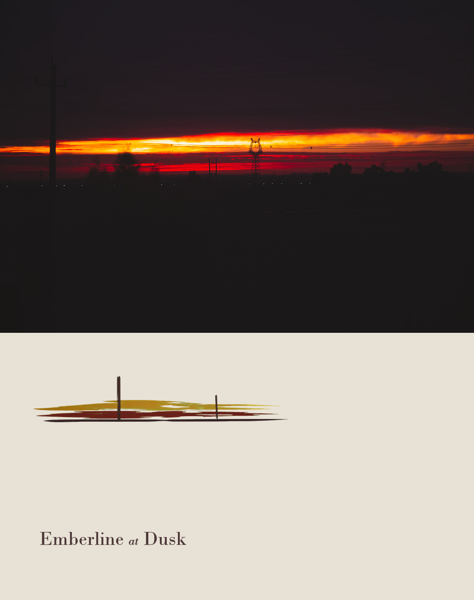 |  |

The Original keeps its fixed lower-left editorial behavior. V3 resolves the same long horizon as Wide Horizon and applies the current scene-aware composition. The comparison explains different decisions; it does not claim that one edition is universally better.

## 🎛️ V3 Control Showcase

These three outputs use the same E03 Landscape source and the same Wide Horizon layout. The variants are real Codex orchestration-level control prompts, and all three passed the machine validator.

| Abstraction 30 | Abstraction 60 | Abstraction 80 |
|---|---|---|
| 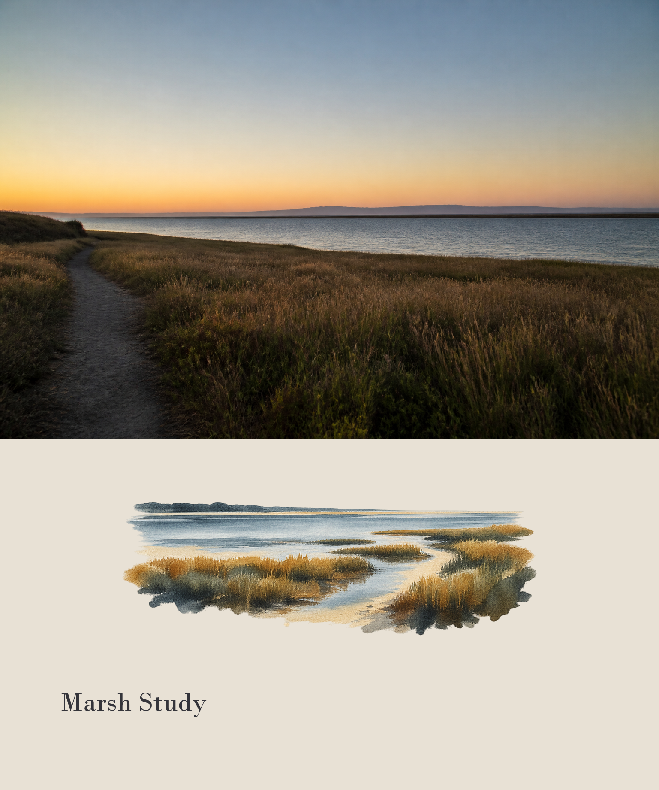 | 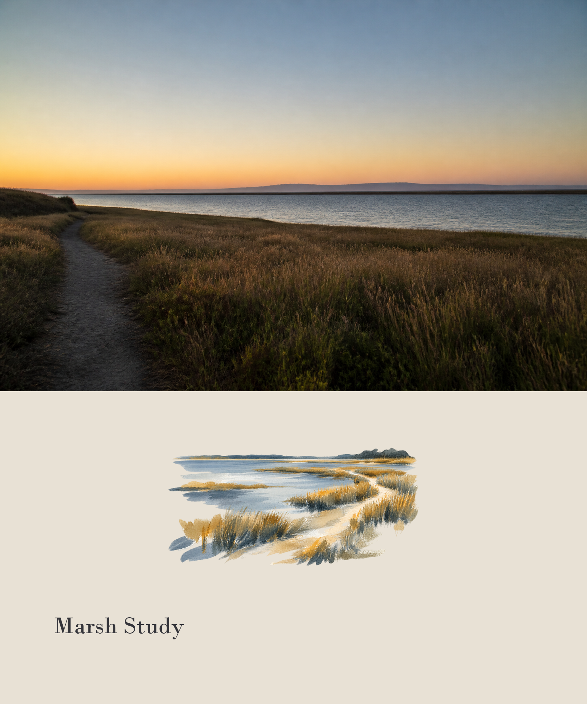 | 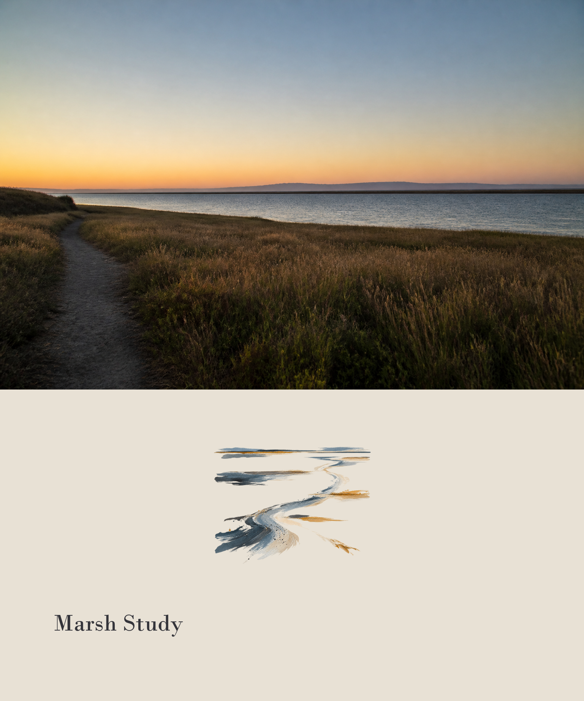 |

The current compositor does not expose these values as a numeric command-line argument; the report records them as applied orchestration decisions rather than machine-enforced scores.

## 🗂️ V3 Series Showcase

These three actual outputs were reviewed as a Codex-side series-style evaluation: same warm-ivory panel language, Bodoni typography family, whole-run kerning, restrained whitespace, and source-traceable mark vocabulary, while each image keeps its own scene logic.

**Same visual family. Different source logic.**

| Landscape | Street / Crowd | Minimal / Light |
|---|---|---|
| 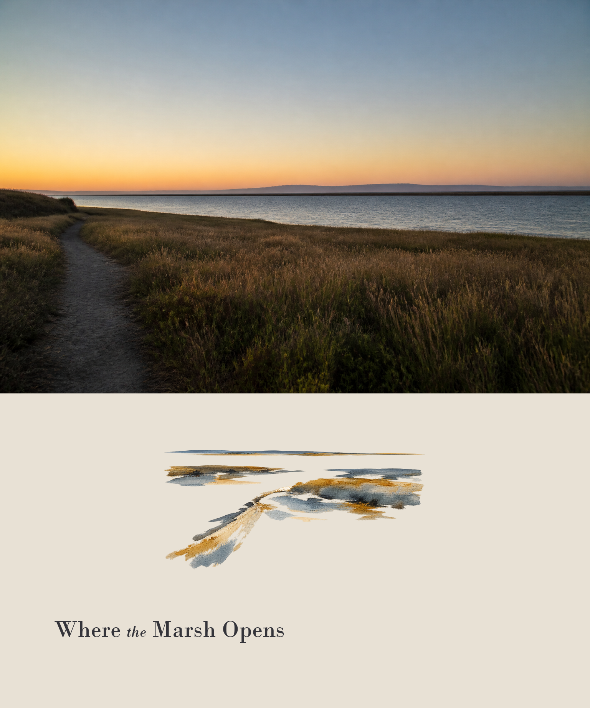 | 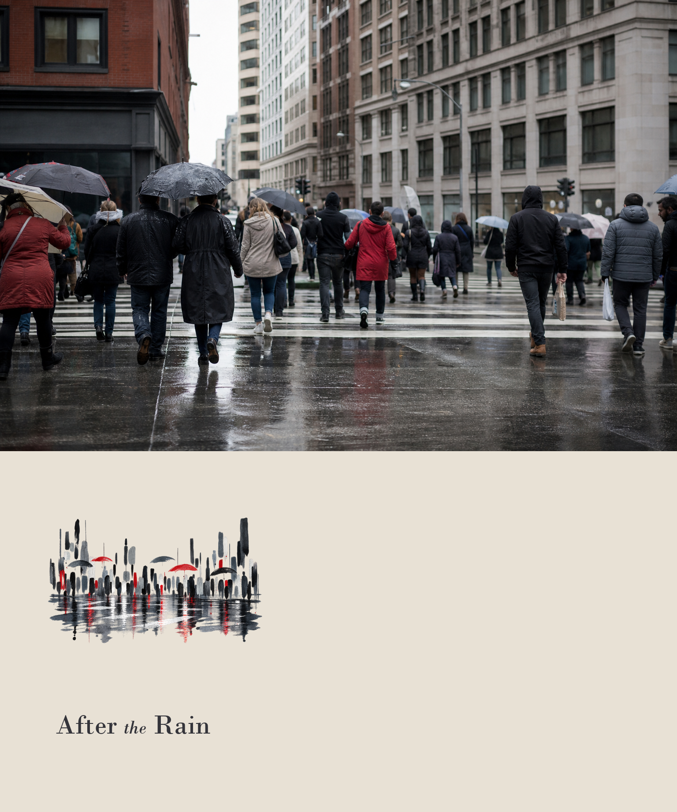 |  |

This is a real visual PASS review of the documented Series Style Lock contract on Codex outputs. The current runtime does not expose a separate machine flag named Series Style Lock; the series showcase itself remains Codex-side, while the independent DeepSeek validation covers the deterministic capability path described below.

## ⚙️ How It Works

Open the workflow sequence

### Original Edition

Photograph → Codex visual inspection → text-free motif generation → historical cleanup helper → Original compositor → Original validator → visual QA.

### V3 Adaptive Edition

Photograph → Scene Analysis → Creative Controls → Layout Selection → Art Direction → Generation/Edit → Quality Gate → one targeted correction when needed → Final Editorial.

### V3 Strict Fidelity Pipeline

Transparent motif → portable chroma cleanup → deterministic composer → exact local typography → manifest → machine validator.

## ✅ Validation

The numbers below are from the current public source and the v3.0.0 release, not historical estimates.

- Original Edition: 32/32 tests passed in the isolated v1.0.0 worktree.
- Original Edition: its own builder and --check passed; its historical example validator returned ok=true.
- Original package: 9 runtime files; SHA-256 a1a44b1a9cec9ba04b379a7d3a14315701abb14bb93e953003337870772d0a6d.
- V3 Adaptive Edition: 41/41 tests passed on Codex.
- V3 package: 15 runtime files; package build and --check passed.
- V3 RC evaluation: 7 scene results and 5 control variants passed the validator and photo-region pixel-exact checks.
- V3 layouts: all 5 canonical layouts exercised on real source images.
- V3 same-source comparison: validator PASS for the new V3 result.
- V3 package excludes README assets, docs/evals, tests, caches, and temporary outputs.

Built to be checked, not just generated.

## 🔬 Independent Validation

An independent DeepSeek Harness run completed the deterministic capability path.

- DeepSeek Harness: PASS
- Strict Fidelity: VERIFIED on the tested pipeline
- Repository tests: 41/41 passed
- Structured visual/editorial QA: 8/8 PASS
- Machine validator: `ok: true`; validator errors: `[]`
- Blocking issues: 0
- Cross-agent compatibility: VERIFIED for the tested capability path
- Pipeline smoke checks: `remove_chroma_key.py`, `compose_editorial.py`, and `validate_editorial.py` all exited 0

See the concise [DeepSeek Harness validation summary](docs/evals/deepseek-harness-validation.md). DeepSeek Harness did not expose native neural image generation during this validation, so motif synthesis used deterministic procedural Pillow generation. This limitation did not change the verified photo-region pixel exactness, source hash, geometry, typography, deterministic composition, or machine-validation results.

## 🌐 Compatibility

### Original Edition

**CODEX ONLY.** Original is implemented and validated within its Codex-specific runtime contract. It is not supported on Claude, Gemini, Cursor, or other Agents.

### V3 Adaptive Edition

- Validated runtime paths: Codex Strict Fidelity and an independent DeepSeek Harness Strict Fidelity run.
- Designed for capability-based compatibility: suitable image-capable Agents/Harnesses that provide the required capabilities.
- Cross-agent compatibility is verified for the tested capability path; this does not imply that every Agent exposes identical native tools.

DESIGNED FOR COMPATIBILITY is not the same as VALIDATED.

## 📥 Releases

### Photo Abstract Editorial — Original Edition

- Tag: v1.0.0
- Runtime: Codex only
- Release: [Original Edition release](https://github.com/kwhi6693-web/photo-abstract-editorial/releases/tag/v1.0.0)
- Artifact: [photo-abstract-editorial-original.zip](https://github.com/kwhi6693-web/photo-abstract-editorial/releases/download/v1.0.0/photo-abstract-editorial-original.zip)
- Demo: preserved historical README source/result pair
- Audit: [Original Edition feature and provenance audit](docs/releases/original-edition.md)

### Photo Abstract Editorial V3 Adaptive — v3.0.0

- Tag: v3.0.0
- Release: [V3 Adaptive stable release](https://github.com/kwhi6693-web/photo-abstract-editorial/releases/tag/v3.0.0)
- Artifact: [photo-abstract-editorial-skill.zip](https://github.com/kwhi6693-web/photo-abstract-editorial/releases/download/v3.0.0/photo-abstract-editorial-skill.zip)
- Validation: Codex regression, build, package, and release-preflight checks PASS
- Independent validation: DeepSeek Harness PASS for the tested deterministic capability path

v3.0.0 is the current formal stable release.

## 🔄 Switching / Upgrade Guide

Stay on Original if you prefer the fixed historical visual behavior, use Codex, and want a smaller workflow.

Try V3 if you need scene adaptation, four creative controls, automatic layouts, structured QA, or series work.

No Original user is required to migrate. The two packages can remain available side by side.

## ❓ FAQ

### Can Original run outside Codex?

No. Original is CODEX ONLY.

### Which edition should I download?

Download Original for the historical fixed Codex workflow. Download V3 for adaptive scene logic and explicit controls.

### Does V3 require manually setting controls?

No. The default workflow resolves them from the source. You may provide natural-language values when you want a deliberate bias.

### Why can Native Image Edit and Reference Generation not guarantee pixel-exact output?

Those modes depend on host/model image operations rather than the local deterministic Strict compositor.

### Can both editions remain available?

Yes. That is the purpose of the dual-edition release structure.

### Is V3 validated on Claude, Gemini, or Cursor?

Not in this repository's published evidence. DeepSeek Harness is independently verified for the tested deterministic capability path; other Agents remain capability-dependent and untested.

### What does Series Style Lock preserve?

It preserves a visual family such as panel language, palette, typography, whitespace, and mark vocabulary while re-analyzing each source instead of copying coordinates or motifs.

## 🛠️ Technical Details

V3 runtime structure

~~~text
photo-abstract-editorial/
|- SKILL.md
|- agents/openai.yaml
|- references/
|- scripts/compose_editorial.py
|- scripts/remove_chroma_key.py
|- scripts/validate_editorial.py
`- assets/examples/
~~~

Reproducible packages

Original uses the Original Edition builder from the historical v1.0.0 tree and contains 9 runtime files. V3 uses the current builder and contains 15 runtime files. Both builders exclude development-only material from their runtime archive and verify archive entries against their own source tree.

Manifest and Strict checks

V3 manifests record source/output hashes, rendered photo-region hash, panel geometry, layout profile, motif region, cleanup details, and typography runs. The validator checks the manifest, dimensions, geometry, panel corners, source hash, output hash, and photo-region pixels.

## 📌 Project Status

- Original Edition: supported, preserved, and available as the historical v1.0.0 release.
- V3 Adaptive Edition: current formal stable release with Codex validation and independent DeepSeek Harness validation for the tested capability path.
- Documentation: three-language dual-edition README and real demo assets.
- Cross-agent compatibility: verified for the tested DeepSeek Harness capability path; other Agents remain untested.
- Formal v3.0.0: current stable release.

## ⚖️ License

This project and its public releases are licensed under AGPL-3.0. See [LICENSE](LICENSE).
