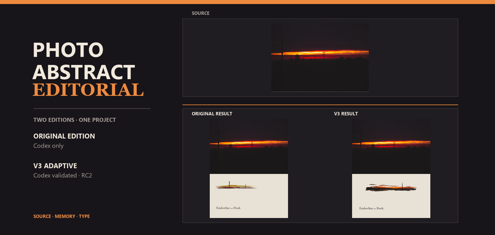

# 🎨 Photo Abstract Editorial

將一張照片轉化為「原始攝影區域 + 抽象記憶面板 + 詩意英文標題」的攝影抽象編輯作品。

[English](README.md) · [簡體中文](README.zh-CN.md) · [繁體中文](README.zh-TW.md)

    

本專案保留原照片的事實性，用克制的抽象面板承載視覺記憶，並在具備 Strict Fidelity 時本地渲染編輯標題。

**一個專案，兩種版本，由你選擇。**

## 🧭 選擇你的版本

| | Original Edition | V3 Adaptive Edition |
|---|---|---|
| 定位 | 保留的原始 Codex 工作流 | 自適應、基於能力的 V3 工作流 |
| 執行環境 | 僅支援 CODEX | Codex 已驗證；面向具備所需圖像能力的 Agents/Harnesses 設計 |
| 視覺行為 | 固定、克制 | 場景感知、可控制、版式感知 |
| 下載 | [Original 發布頁](https://github.com/kwhi6693-web/photo-abstract-editorial/releases/tag/v1.0.0) | [目前 V3 RC](https://github.com/kwhi6693-web/photo-abstract-editorial/releases/tag/v3.0.0-rc2) |

### Original Edition

如果你希望使用歷史固定工作流、已經使用 Codex，並偏好更簡單的原始藝術指導約束，請選擇 Original。

### V3 Adaptive Edition

如果你需要場景適配、四軸控制、自動版式選擇、結構化 QA、有邊界的修正，或一致的多圖視覺家族，請選擇 V3。

## 🧭 應該選擇哪個版本？

- 想要原始固定視覺行為？選擇 Original Edition。
- 需要場景適配、控制、版式設定或系列一致性？選擇 V3 Adaptive Edition。
- 正在使用非 Codex Agent？Original 不支援。若宿主具備所需圖像與本地處理能力，V3 可能適用，但額外 Agent 執行環境驗證仍待完成。
- 想要最小且最忠實於歷史的安裝包？選擇 Original。
- 想要更明確的能力與驗證約束？選擇 V3。

## 🔍 原始版與 V3 自適應版比較

| 維度 | Original Edition | V3 Adaptive Edition |
|---|---|---|
| 定位 | V3 之前保留的工作流 | 自適應 photo-plus-abstraction Skill |
| 執行環境 | 僅 Codex | Codex 已驗證；依基於能力的相容性設計 |
| 複雜度 | 更小、更固定 | 更多輸入、設定與驗證邊界 |
| 藝術指導 | 暖象牙色面板、源圖派生的克制母題、光學編輯間距 | 保留編輯基礎，並增加場景感知藝術指導與控制解析度 |
| 源圖保真度 | Original 範例已驗證 pixel-exact 攝影區域 | Codex Strict Fidelity 已驗證 pixel-exact 攝影區域 |
| 創意控制 | 手動標題、面板、母題、對齊與字型覆蓋 | Abstraction、Creative Freedom、Identity Preservation、Spatial Fidelity，各 0–100 |
| 場景設定 | 無 | 7 個：Pure Portrait、Environmental Portrait、Landscape、Architecture、Street/Crowd、Still Life、Minimal/Light |
| 肖像適配 | 在適合時使用源圖派生的不等高縱向錨點 | 肖像感知場景設定與身份保留解析度 |
| 版式系統 | Lower Editorial 前身：lower-left 或 bottom-center | 5 個規範設定：Lower Editorial、Wide Horizon、Vertical Monument、Centered Archive、Sparse Object |
| QA | 機器驗證器 + 視覺 QA；Original 範例有 9 項驗證器檢查 | 結構化 8 維 QA、機器驗證器與明確的 HARD FAIL 規則 |
| 重試 | 一次針對性母題修正；最多兩次母題嘗試 | 完整嘗試後最多一次針對性修正；關鍵 HARD FAIL 仍存在時停止 |
| 系列 | 沒有 Series Style Lock 約束 | 可選 Series Style Lock 流程 |
| Agent 相容性 | 僅 Codex | 面向具備能力的 image-capable Agents/Harnesses 設計；目前只有 Codex 已驗證 |
| 安裝方式 | 歷史 Original 安裝包 | V3 Adaptive 安裝包與目前 RC |
| 適用場景 | 穩定、熟悉、Codex-specific 的原始行為 | 不同場景、明確控制、版式適配與系列工作 |
| 主要取捨 | 自適應較少，不能脫離 Codex | 流程與能力要求更多；額外 Agent 驗證待完成 |

## 🎯 適用範圍、限制與能力保證

### Original Edition

適合在 Codex 中用一張照片、一個無文字母題與一個固定編輯版式完成一次作品。它提供確定性本地合成與 Original 驗證器的源圖/面板檢查，但不提供 V3 控制項系統、場景設定、規範自動版式、Series Style Lock 或跨 Agent 約束。它不支援 Codex 之外的宿主。

### V3 Adaptive Edition

適合需要明確場景推理、身份與空間控制、自適應版式或系列視覺家族的照片。V3 不應憑空生成沒有來源的人物、建築、物體、地理、文字、logo、水印、色卡或裝飾事實。不同宿主與執行的圖像生成可能變化；目前公開 V3 證據來自 Codex。

### 能力保證矩陣

| 能力 | Original | V3 Strict Fidelity | V3 Native Image Edit | V3 Reference Generation |
|---|---|---|---|---|
| 源圖感知行為 | 已實現，並在 Codex 驗證 | 已實現，並在 Codex 驗證 | 盡力而為 | 盡力而為 |
| 場景適配 | 原始固定行為 | 已實現，並在 Codex 評測 | 僅提供藝術指導約束 | 僅提供藝術指導約束 |
| 創意控制 | 手動覆蓋 | 4 個控制項，0–100 | 取決於宿主，屬於盡力而為 | 取決於宿主，屬於盡力而為 |
| 像素精確攝影區域 | Original 範例已驗證 | Strict 條件滿足時經機器驗證 | 不保證 | 不保證 |
| 本地精確排版 | Original 合成器路徑 | 本地排版路徑 | 不保證 | 不保證 |
| 確定性合成 | Original 本地合成器 | V3 本地合成器 | 不保證 | 不保證 |
| 機器驗證 | Original 驗證器 | V3 驗證器與 manifest | 不屬於 Strict 成片 | 不屬於 Strict 成片 |
| 宿主相容性 | 僅 Codex | Codex 已驗證；面向具備相應能力的宿主設計 | 取決於能力 | 取決於能力 |

Native Image Edit 與 Reference Generation 不能被描述為機器驗證的 Strict 成片。

## 💡 這個專案解決什麼問題？

通用圖像提示詞可能重繪原照片、遺失主體身份、編造沒有來源的事實、讓抽象程度不一致，或產生不可靠的排版。固定版式也可能適合一張照片，卻不適合另一張。

Photo Abstract Editorial 將事實照片與生成的抽象母題分開，讓版式與創意決策明確化，在具備 Strict Fidelity 時使用本地排版，並在交付前加入品質門禁。Original 保留第一版穩定工作流；V3 讓自適應決策更加明確。

## ✨ 主要功能

### Original Edition

- 一張源照片與一個稀疏無文字母題。
- 源圖派生的色帶、間隙、偏移，以及在來源支援時使用的不等高縱向錨點。
- 暖象牙色面板、克制配色、精確英文標題與光學間距。
- 確定性本地合成與 JSON manifest。
- Original 源圖/輸出衝突保護與攝影區域逐像素驗證。
- 機器驗證與視覺 QA。

### V3 Adaptive Edition

- 在 Strict Fidelity、Native Image Edit、Reference Generation 之間進行基於能力的路由。
- 四個 Creative Controls：Abstraction、Creative Freedom、Identity Preservation、Spatial Fidelity。
- 7 個場景設定與肖像感知抽象。
- 5 個確定性版式設定。
- 結構化 8 維 QA 與有邊界的針對性重試。
- 可選 Series Style Lock 流程。
- 可攜式色鍵清理、本地精確排版、manifest、機器驗證器與可重現安裝包。

## 🧩 V3 執行模式

### Strict Fidelity

當宿主具備視覺理解、圖像生成、本地檔案存取、Python、相容 Pillow 的處理能力與可用襯線字型時，V3 可以提供確定性合成、本地精確排版、manifest、機器驗證器，以及在不縮放時對攝影區域進行 pixel-exact verification。

### Native Image Edit

以源圖作為編輯/參考圖，在宿主支援時沿用相同的藝術指導與 QA 約束。這是盡力而為，不保證 pixel-exact、確定性、本地精確排版或機器驗證的 Strict。

### Reference Generation

以源圖作為唯一事實參考，執行依賴模型的生成路徑。這是盡力而為，不提供 Strict Fidelity 保證。

## 📋 執行要求

### Original Edition

**僅 Codex。** Original 工作流需要 Codex 視覺檢查、內建圖像生成路徑、歷史工作流使用的 Codex 工作區/執行環境輔助工具、Python 3.10+、Pillow、可用襯線字型、一張照片與透明母題。

### V3 Strict Fidelity

需要視覺理解、圖像生成、本地檔案系統存取、Python 3.10+、相容 Pillow 的處理能力、可用襯線字型、一張照片與透明母題。

### V3 Native Image Edit

需要視覺理解與宿主的圖像編輯/合成能力；不提供 pixel-exact Strict 保證。

### V3 Reference Generation

需要視覺理解、圖像生成與參考圖支援；結果依賴模型，屬於盡力而為。

## 📦 安裝方法

### Original Edition

下載 [photo-abstract-editorial-original.zip](https://github.com/kwhi6693-web/photo-abstract-editorial/releases/download/v1.0.0/photo-abstract-editorial-original.zip)，解壓其中的 photo-abstract-editorial 資料夾，並安裝到 Codex Skill 目錄。Original 僅支援 Codex。

儲存庫中的副本是 [dist/photo-abstract-editorial-original.zip](dist/photo-abstract-editorial-original.zip)。

### V3 Adaptive Edition

下載 [photo-abstract-editorial-skill.zip](https://github.com/kwhi6693-web/photo-abstract-editorial/releases/download/v3.0.0-rc2/photo-abstract-editorial-skill.zip)，或直接讓 Codex 從公開儲存庫安裝根目錄 Skill：

儲存庫中的副本是 [dist/photo-abstract-editorial-skill.zip](dist/photo-abstract-editorial-skill.zip)。

~~~text
Use $skill-installer to install the root photo-abstract-editorial Skill from https://github.com/kwhi6693-web/photo-abstract-editorial.
~~~

該安裝包只包含 V3 執行環境檔案。README 素材、評測檔案、測試、快取與暫存輸出不進入 V3 執行環境安裝包。

## 🚀 使用方法

### Original Edition

~~~text
Use $photo-abstract-editorial to turn this photograph into a strict-fidelity photo-and-abstract editorial composition.
~~~

Original 提示詞會呼叫歷史 Codex-specific 工作流。

### V3 Adaptive Edition — 預設模式

~~~text
Use $photo-abstract-editorial to create an adaptive, source-faithful photo-and-abstract editorial from this image.
~~~

### V3 Adaptive Edition — 受控模式

~~~text
Use $photo-abstract-editorial. Set Abstraction to 60, Creative Freedom to 45, Identity Preservation to 80, and Spatial Fidelity to 70. Resolve the scene and layout from the photograph, then run the applicable QA.
~~~

### V3 Adaptive Edition — 系列模式

~~~text
Use $photo-abstract-editorial for this three-image series. Keep a restrained warm-ivory editorial family, but re-analyze each photograph and choose its own motif, layout, and spatial relationships.
~~~

目前 Skill 約束中的控制項是自然語言工作流輸入，不聲稱是數值合成器 API。

## 🖼️ 輸入與輸出

普通源照片

→ 場景事實與源圖派生關係

→ 抽象母題、面板與精確標題

→ 機器驗證與視覺 QA

→ Photo Abstract Editorial 成品

## 🎞️ 真實演示

以下 V3 圖片全部來自 RC 評測資料集，是實際 Codex Strict Fidelity 輸出並通過驗證器；不是宣傳用重構圖。

| 場景 | 版本 | 版式 | 驗證 |
|---|---|---|---|
| Pure Portrait | V3 Adaptive | Vertical Monument | Strict PASS |
| Landscape | V3 Adaptive | Wide Horizon | Strict PASS |
| Architecture | V3 Adaptive | Centered Archive | Strict PASS |
| Still Life | V3 Adaptive | Sparse Object | Strict PASS |
| Minimal / Light | V3 Adaptive | Sparse Object | Strict PASS |

| Pure Portrait | Landscape | Architecture |
|---|---|---|
|  |  |  |

| Still Life | Minimal / Light |
|---|---|
|  |  |

完整資料集與清單檔案見 [assets/evals/v3.0-rc1](assets/evals/v3.0-rc1) 與 [RC 評測報告](docs/evals/v3.0-rc1-real-world-evaluation.md)。

## ↔️ 原始版與 V3 同源比較

本比較使用 Original README 中的歷史源圖。Original 成片原樣重用；V3 成片則在之後使用目前 V3 工作流從同一源圖真實生成。

| 同一源圖 | Original 歷史成片 | V3 Adaptive 實際成片 |
|---|---|---|
|  |  |  |

Original 保留固定的 lower-left 編輯行為。V3 將同一長地平線解析為 Wide Horizon，並套用目前的場景感知合成。這個比較解釋的是不同決策，不表示某個版本無條件更好。

## 🎛️ V3 控制能力演示

以下三個輸出使用同一 E03 Landscape 源圖與同一 Wide Horizon 版式。它們是真實 Codex 編排層控制項提示詞的結果，並全部通過機器驗證器。

| Abstraction 30 | Abstraction 60 | Abstraction 80 |
|---|---|---|
|  |  |  |

目前合成器沒有將這些值暴露為數值命令列參數；報告把它們記錄為編排層決策，而不是機器強制分數。

## 🗂️ V3 系列風格演示

以下三個實際輸出接受了 Codex 側系列風格評測：共享暖象牙色面板語言、Bodoni 字體排版體系、整段字距調整、克制留白與源圖可追溯的標記語彙，同時保留各自的場景邏輯。

**同一視覺家族，不同源圖邏輯。**

| Landscape | Street / Crowd | Minimal / Light |
|---|---|---|
|  |  |  |

這是對文件化 Series Style Lock 約束的真實 Codex 視覺 PASS 評審。目前執行環境沒有名為 Series Style Lock 的獨立機器標誌，這也不構成獨立 Agent 驗證。

## ⚙️ 工作原理

### Original Edition

照片 → Codex 視覺檢查 → 無文字母題生成 → 歷史清理輔助工具 → Original 合成器 → Original 驗證器 → 視覺 QA。

### V3 Adaptive Edition

照片 → 場景分析 → 創意控制 → 版式選擇 → 藝術指導 → 生成/編輯 → 品質門禁 → 必要時一次針對性修正 → 最終編輯成片。

### V3 Strict Fidelity 路徑

透明母題 → 可攜式色鍵清理 → 確定性合成器 → 本地精確排版 → manifest → 機器驗證器。

## ✅ 驗證

以下數字來自目前公開原始碼與本輪發布準備，不是歷史估算。

- Original Edition：隔離的 v1.0.0 工作樹中 32/32 測試通過。
- Original Edition：自身構建器與 --check 通過；歷史範例驗證器返回 ok=true。
- Original 安裝包：9 個執行環境檔案；SHA-256 為 a1a44b1a9cec9ba04b379a7d3a14315701abb14bb93e953003337870772d0a6d。
- V3 Adaptive Edition：Codex 上 41/41 測試通過。
- V3 安裝包：15 個執行環境檔案；安裝包構建與 --check 通過。
- V3 RC 評測：7 個場景成片與 5 個控制變體通過驗證器與攝影區域逐像素檢查。
- V3 版式：5 個規範版式全部在真實源圖上執行過。
- V3 同源比較：新的 V3 成片驗證器 PASS。
- V3 安裝包排除 README 素材、docs/evals、測試、快取與暫存輸出。

重點是可驗證，而不只是生成。

## 🌐 相容性

### Original Edition

**僅 CODEX。** Original 在其 Codex-specific 執行環境約束內完成實作與驗證。不支援 Claude、Gemini、Cursor 或其他 Agent。

### V3 Adaptive Edition

- 已驗證的執行環境：Codex。
- 按能力設計：面向具備所需能力的圖像 Agents/Harnesses。
- 在額外 Agent 上的獨立執行環境驗證：待完成。

DESIGNED FOR COMPATIBILITY 不等於 VALIDATED。

## 📥 版本發布

### Photo Abstract Editorial — Original Edition

- 標籤：v1.0.0
- 執行環境：僅 Codex
- 發布頁：[Original Edition 發布頁](https://github.com/kwhi6693-web/photo-abstract-editorial/releases/tag/v1.0.0)
- 安裝包：[photo-abstract-editorial-original.zip](https://github.com/kwhi6693-web/photo-abstract-editorial/releases/download/v1.0.0/photo-abstract-editorial-original.zip)
- 演示：保留歷史 README 源圖/成片對
- 審計：[Original Edition 功能與來源審計](docs/releases/original-edition.md)

### Photo Abstract Editorial V3 Adaptive — v3.0.0-rc2

- 標籤：v3.0.0-rc2
- 發布頁：[V3 Adaptive 預發布版本](https://github.com/kwhi6693-web/photo-abstract-editorial/releases/tag/v3.0.0-rc2)
- 安裝包：[photo-abstract-editorial-skill.zip](https://github.com/kwhi6693-web/photo-abstract-editorial/releases/download/v3.0.0-rc2/photo-abstract-editorial-skill.zip)
- 驗證：Codex 側測試與 RC 證據 PASS
- 限制：獨立的額外 Agent 執行環境驗證待完成

正式 v3.0.0 有意不發布。

## 🔄 版本選擇與切換

如果你偏好固定的歷史視覺行為、使用 Codex 並希望更小的工作流，可以繼續使用 Original。

如果你需要場景適配、四軸創意控制、自動版式、結構化 QA 或系列工作，可以嘗試 V3。

Original 使用者不需要遷移；兩個安裝包可以並行保留。

## ❓ 常見問題

### Original 可以在 Codex 之外執行嗎？

不可以。Original 是 CODEX ONLY。

### 應該下載哪個版本？

想要歷史固定 Codex 工作流就下載 Original；想要自適應場景邏輯與明確控制就下載 V3。

### V3 必須手動設定控制項嗎？

不需要。預設工作流會從源圖解析它們；你也可以在需要明確傾向時提供自然語言數值。

### 為什麼 Native Image Edit 與 Reference Generation 不能保證 pixel-exact？

因為它們依賴宿主或模型的圖像操作，而不是本地確定性 Strict 合成器。

### 兩個版本可以同時保留嗎？

可以。這正是雙版本發布結構的目的。

### V3 已在 Claude、Gemini 或 Cursor 上驗證了嗎？

沒有。額外 Agent 執行環境驗證待完成。

### Series Style Lock 實際保留什麼？

它保留面板語言、配色、排版、留白與標記語彙等視覺家族，同時重新分析每張源圖，而不是複製座標或母題。

## 🛠️ 技術細節

V3 執行環境結構

~~~text
photo-abstract-editorial/
|- SKILL.md
|- agents/openai.yaml
|- references/
|- scripts/compose_editorial.py
|- scripts/remove_chroma_key.py
|- scripts/validate_editorial.py
`- assets/examples/
~~~

可重現安裝包

Original 使用歷史 v1.0.0 程式碼樹中的 Original Edition 建構器，包含 9 個執行環境檔案。V3 使用目前建構器，包含 15 個執行環境檔案。兩個建構器都會排除僅開發用途內容，並根據各自程式碼樹驗證歸檔條目。

Manifest 與 Strict 檢查

V3 manifest 記錄源圖/輸出雜湊、渲染後攝影區域雜湊、面板幾何資訊、版式設定、母題區域、清理詳情與排版執行記錄。驗證器檢查 manifest、尺寸、幾何資訊、面板角點、源圖雜湊、輸出雜湊與攝影區域像素。

## 📌 專案狀態

- Original Edition：支援、保留，並作為歷史 v1.0.0 發布版本提供。
- V3 Adaptive Edition：目前公開候選版本，已完成 Codex 驗證。
- 文件：三語言雙版本 README 與真實演示素材。
- 獨立的額外 Agent 執行環境驗證：待完成。
- 正式 v3.0.0：未發布。

## ⚖️ 授權條款

本專案及其公開發布版本使用 AGPL-3.0。參見 [LICENSE](LICENSE)。
